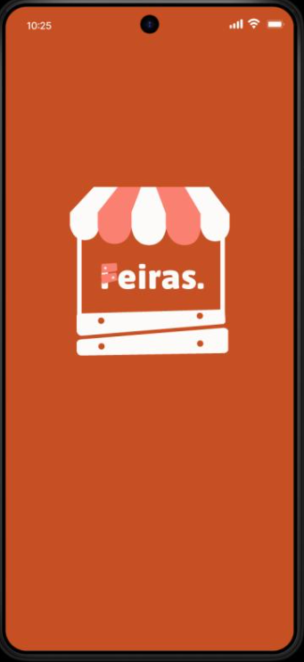
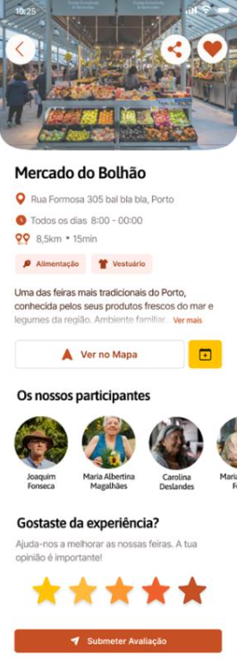

# Fairs & Markets Mobile App 📱

## About
Mobile application designed to centralize information about fairs and markets in the Porto district.  
The app targets both consumers and vendors, improving access to events and promoting local businesses.

## Key Features
- Interactive map with fairs and markets
- User authentication (consumer / vendor)
- Favorites (fairs and vendors)
- Fair details (location, schedule, vendors)
- Google Calendar integration
- Push notifications (conceptual)

## Technologies
- React Native
- Typescript
- microservice architeture 
- Google Maps API (concept)
- Android Studio/ios

### Architecture & Technologies:
- Frontend: React Native + Expo
- Backend: Node.js + TypeScript
- Session Persistence: AsyncStorage
- APIs: Google Cloud (Maps and Calendar)
- Modular structure with screens, components and services.

### How to Run:

#### Backend 
cd backend  /  npm install  /  npx ts-node server.ts 

#### Frontend 
cd frontend  /  npm install  /  npx expo start **or** npx expo start --tunnel

## 👥 Team

<table> <tr> <td align="center"> <a href="https://github.com/nuno-nogueira">    <b>Nuno Nogueira</b> </a> </td>

<td align="center">
  <a href="https://github.com/AnaCatarina7">
    
     
    <b>Ana Catarina</b>
  </a>
</td>

<td align="center">
  <a href="https://github.com/kenLukau31">
    
     
    <b>Ken Lukau</b>
  </a>
</td>

<td align="center">
  <a href="https://github.com/sandrafmoreira">
    
     
    <b>Sandra Moreira</b>
  </a>
</td>
